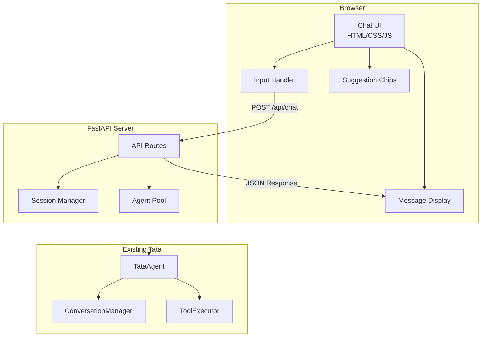

# Design Document: Chat Interface

## Overview

This design describes a minimal web-based chat interface for Tata that replaces the terminal-based interaction. The solution uses FastAPI for the backend server and vanilla HTML/CSS/JavaScript for the frontend, keeping dependencies minimal while providing a robust input handling experience.

The architecture follows a simple client-server model where the browser handles UI rendering and user input, while the Python backend manages sessions and routes messages to the existing TataAgent infrastructure.

## Architecture



## Components and Interfaces

### Backend Components

#### ChatServer

The main FastAPI application that serves the web interface and handles API requests.

```python
class ChatServer:
    """FastAPI-based web server for Tata chat interface.
    
    Attributes:
        app: FastAPI application instance
        session_manager: SQLiteSessionManager for persistence
        memory_manager: SQLiteMemoryManager for artifacts
        agents: Dict mapping session_id to TataAgent instances
        port: Server port (default 8080)
    """
    
    def __init__(self, port: int = 8080) -> None:
        """Initialize the chat server."""
        ...
    
    def get_or_create_agent(self, session_id: str) -> TataAgent:
        """Get existing agent for session or create new one."""
        ...
    
    def run(self) -> None:
        """Start the server."""
        ...
```

#### API Routes

| Endpoint | Method | Description |
|----------|--------|-------------|
| `/` | GET | Serve the chat HTML page |
| `/api/sessions` | GET | List sessions for recruiter |
| `/api/sessions` | POST | Create new session |
| `/api/sessions/{id}` | GET | Get session details |
| `/api/chat` | POST | Send message and get response (includes suggestions) |
| `/api/suggestions/{session_id}` | GET | Get available next actions based on session state |

#### Request/Response Models

```python
@dataclass
class ChatRequest:
    """Request body for chat endpoint.
    
    Attributes:
        session_id: Active session identifier
        message: User's message text
    """
    session_id: str
    message: str

@dataclass
class ChatResponse:
    """Response body from chat endpoint.
    
    Attributes:
        response: Tata's response text
        error: Error message if request failed (None on success)
        suggestions: List of context-aware next action suggestions
    """
    response: str | None
    error: str | None
    suggestions: list[str]  # Context-aware suggestions based on session state

@dataclass
class SessionInfo:
    """Session information for API responses.
    
    Attributes:
        id: Session identifier
        position_name: Job position name
        language: Output language code
        last_activity: ISO timestamp of last activity
    """
    id: str
    position_name: str | None
    language: str
    last_activity: str

@dataclass
class CreateSessionRequest:
    """Request body for creating a session.
    
    Attributes:
        recruiter_id: Recruiter identifier
        position_name: Job position name
        language: Language code (en, sv, da, no, de)
    """
    recruiter_id: str
    position_name: str
    language: str = "en"
```

### Frontend Components

#### HTML Structure

```html
<!DOCTYPE html>
<html>
<head>
    <title>Tata - Recruitment Assistant</title>
    <style>/* Embedded CSS */</style>
</head>
<body>
    <header id="header">
        <h1>Tata</h1>
        <span id="session-name">No session selected</span>
    </header>
    
    <main id="chat-container">
        <div id="messages"></div>
        <div id="suggestions"></div>
        <div id="input-area">
            <textarea id="message-input" placeholder="Type a message..."></textarea>
            <button id="send-btn">Send</button>
        </div>
    </main>
    
    <aside id="session-panel">
        <!-- Session selector UI -->
    </aside>
    
    <script>/* Embedded JavaScript */</script>
</body>
</html>
```

#### JavaScript Modules

**InputHandler**: Manages textarea input, keyboard events, and message submission.

```javascript
const InputHandler = {
    textarea: null,
    sendButton: null,
    onSubmit: null,
    
    init(textareaId, buttonId, submitCallback) { ... },
    
    handleKeyDown(event) {
        // Enter without Shift = submit
        // Shift+Enter = newline
    },
    
    submit() {
        // Validate non-empty, call onSubmit, clear input
    },
    
    populate(text, cursorPosition) {
        // Set textarea value and cursor position
    },
    
    setEnabled(enabled) {
        // Enable/disable input during processing
    }
};
```

**MessageDisplay**: Renders messages and manages auto-scroll.

```javascript
const MessageDisplay = {
    container: null,
    
    init(containerId) { ... },
    
    addMessage(content, isUser) {
        // Create message element with appropriate styling
        // Preserve whitespace
        // Auto-scroll to bottom
    },
    
    showLoading() {
        // Show typing indicator
    },
    
    hideLoading() {
        // Remove typing indicator
    },
    
    clear() {
        // Clear all messages
    }
};
```

**SuggestionChips**: Displays context-aware suggestions based on session state.

```javascript
const SuggestionChips = {
    container: null,
    inputHandler: null,
    
    // Suggestion templates mapped to module types
    SUGGESTION_TEMPLATES: {
        // Standalone modules (always available)
        'REQUIREMENT_PROFILE': 'Create a requirement profile for ',
        'FUNNEL_REPORT': 'Create a funnel report for ',
        'JOB_AD_REVIEW': 'Review this job ad:\n\n',
        'DI_REVIEW': 'Check this text for inclusive language:\n\n',
        'CALENDAR_INVITE': 'Create a calendar invite for ',
        // Dependent modules (require prerequisite artifacts)
        'JOB_AD': 'Generate a job ad',
        'TA_SCREENING': 'Create TA screening questions',
        'HM_SCREENING': 'Create HM screening questions',
        'HEADHUNTING': 'Write a headhunting message',
        'CANDIDATE_REPORT': 'Generate candidate report for '
    },
    
    init(containerId, inputHandler) { ... },
    
    update(availableModules) {
        // Render chips for available modules based on session state
        // Called after each Tata response with updated suggestions
    },
    
    render(suggestions) {
        // Create clickable chip elements from suggestion list
    },
    
    handleClick(suggestion) {
        // Populate input with suggestion text
    }
};
```

**SuggestionService**: Backend service to determine available next actions.

```python
class SuggestionService:
    """Determines available next actions based on session state.
    
    Uses DependencyManager to check which modules can be executed
    based on existing artifacts in the session.
    """
    
    def __init__(
        self, 
        dependency_manager: DependencyManager,
        memory_manager: MemoryManager
    ):
        self._deps = dependency_manager
        self._memory = memory_manager
    
    def get_suggestions(self, session_id: str) -> list[str]:
        """Get available next action suggestions for a session.
        
        Returns suggestions based on:
        - Standalone modules are always available
        - Dependent modules only if prerequisites exist
        
        Args:
            session_id: The session to check
            
        Returns:
            List of suggestion strings for available actions
        """
        suggestions = []
        
        for module in ModuleType:
            check = self._deps.can_execute(session_id, module)
            if check.can_proceed:
                suggestions.append(self._get_suggestion_for_module(module))
        
        return suggestions
    
    def _get_suggestion_for_module(self, module: ModuleType) -> str:
        """Map module type to user-friendly suggestion text."""
        ...
```

**SessionSelector**: Manages session list and creation.

```javascript
const SessionSelector = {
    panel: null,
    currentSession: null,
    
    init(panelId) { ... },
    
    async loadSessions(recruiterId) {
        // Fetch and display sessions
    },
    
    async createSession(recruiterId, positionName, language) {
        // POST to create session
    },
    
    selectSession(session) {
        // Set current session, update header
    }
};
```

**ApiClient**: Handles HTTP communication with backend.

```javascript
const ApiClient = {
    baseUrl: '',
    
    async sendMessage(sessionId, message) {
        // POST to /api/chat
        // Return response or throw error
    },
    
    async getSessions(recruiterId) {
        // GET /api/sessions?recruiter_id=...
    },
    
    async createSession(recruiterId, positionName, language) {
        // POST /api/sessions
    }
};
```

## Data Models

### Backend Data Flow

The chat interface reuses existing Tata data models:

- `Session` from `src/tata/session/session.py` - recruitment session state
- `TataAgent` from `src/tata/agent/agent.py` - conversation orchestration
- `SQLiteSessionManager` from `src/tata/persistence/sqlite.py` - session persistence
- `SQLiteMemoryManager` from `src/tata/persistence/sqlite.py` - artifact storage

New models are minimal API wrappers:

```python
# Pydantic models for FastAPI request/response validation
from pydantic import BaseModel

class ChatRequestModel(BaseModel):
    session_id: str
    message: str

class ChatResponseModel(BaseModel):
    response: str | None = None
    error: str | None = None
    suggestions: list[str] = []  # Context-aware next actions

class SessionInfoModel(BaseModel):
    id: str
    position_name: str | None
    language: str
    last_activity: str

class CreateSessionModel(BaseModel):
    recruiter_id: str
    position_name: str
    language: str = "en"

class SuggestionsResponseModel(BaseModel):
    suggestions: list[str]
```

### Frontend State

```javascript
// Application state (kept minimal)
const AppState = {
    currentSession: null,      // SessionInfo object
    recruiterId: 'default',    // Current recruiter
    isProcessing: false,       // Waiting for response
    hasMessages: false         // Whether conversation has started
};
```


## Correctness Properties

*A property is a characteristic or behavior that should hold true across all valid executions of a system—essentially, a formal statement about what the system should do. Properties serve as the bridge between human-readable specifications and machine-verifiable correctness guarantees.*

### Property 1: Input Content Preservation

*For any* string containing special characters (unicode, emojis, tabs, multiple spaces, newlines), when that string is pasted or typed into the Input_Handler, the value retrieved from the textarea SHALL be identical to the original string.

**Validates: Requirements 2.2**

### Property 2: Whitespace-Only Input Rejection

*For any* string composed entirely of whitespace characters (spaces, tabs, newlines, or empty string), when submitted to the Input_Handler, the submission SHALL be prevented and no message SHALL be sent to the backend.

**Validates: Requirements 2.5**

### Property 3: Input Cleared After Successful Submission

*For any* valid non-whitespace message, after successful submission to the backend, the Input_Handler textarea value SHALL be empty.

**Validates: Requirements 2.6**

### Property 4: Suggestion Chip Population

*For any* suggestion chip in the suggestions list, when clicked, the Input_Handler textarea value SHALL equal the suggestion text exactly.

**Validates: Requirements 7.3**

### Property 5: Message Chronological Ordering

*For any* sequence of messages added to the Message_Display, the DOM order of message elements SHALL match the order in which they were added (first added = first in DOM).

**Validates: Requirements 3.2**

### Property 6: Message Whitespace Preservation

*For any* message content containing whitespace (spaces, tabs, newlines), when rendered by Message_Display, the visible text SHALL preserve all whitespace characters from the original content.

**Validates: Requirements 3.4**

### Property 7: Session Metadata Completeness

*For any* session returned by the API, the SessionSelector display SHALL include the session's position_name (or placeholder if null), language code, and last_activity timestamp.

**Validates: Requirements 4.4**

### Property 8: Context-Aware Suggestions Based on Dependencies

*For any* session state, the suggestions returned by the backend SHALL only include modules where `DependencyManager.can_execute()` returns `can_proceed=True`. Specifically:
- Standalone modules (Requirement Profile, Funnel Report, Job Ad Review, D&I Review, Calendar Invite) SHALL always be suggested
- Dependent modules SHALL only be suggested when their prerequisites exist in memory

**Validates: Requirements 7.2**

## Error Handling

### Backend Errors

| Error Condition | HTTP Status | Response | User Message |
|-----------------|-------------|----------|--------------|
| Session not found | 404 | `{"error": "Session not found"}` | "Session not found. Please select a valid session." |
| Invalid request body | 422 | Pydantic validation error | "Invalid request. Please try again." |
| OpenAI API failure | 500 | `{"error": "Service unavailable"}` | "Tata is temporarily unavailable. Please try again." |
| Port already in use | N/A | Server fails to start | Console: "Error: Port {port} is already in use" |

### Frontend Error Handling

```javascript
// API error handling pattern
async function sendMessage(sessionId, message) {
    try {
        const response = await ApiClient.sendMessage(sessionId, message);
        if (response.error) {
            MessageDisplay.addMessage(`Error: ${response.error}`, false);
        } else {
            MessageDisplay.addMessage(response.response, false);
        }
    } catch (error) {
        MessageDisplay.addMessage(
            "Unable to connect to Tata. Please check your connection.",
            false
        );
    } finally {
        InputHandler.setEnabled(true);
        MessageDisplay.hideLoading();
    }
}
```

### Input Validation

- Empty/whitespace messages: Prevented client-side, no API call made
- Missing session: Prompt user to select/create session before chatting
- Network timeout: Show connection error after 30 second timeout

## Testing Strategy

### Dual Testing Approach

This feature requires both unit tests and property-based tests:

- **Unit tests**: Verify specific examples, edge cases, API integration, and error conditions
- **Property tests**: Verify universal properties across all inputs using Hypothesis

### Test Organization

```
tests/
├── test_chat_server.py      # Backend API tests
├── test_chat_models.py      # Request/response model tests
└── test_chat_frontend.py    # Frontend logic tests (if using pytest-playwright or similar)
```

### Property-Based Testing Configuration

- Framework: `hypothesis` (already in project)
- Minimum iterations: 100 per property test
- Each property test tagged with: `**Feature: chat-interface, Property {N}: {description}**`

### Backend Unit Tests

```python
class TestChatServer:
    """Tests for ChatServer API endpoints."""
    
    def test_root_returns_html(self, client):
        """GET / returns HTML page with chat interface."""
        response = client.get("/")
        assert response.status_code == 200
        assert "text/html" in response.headers["content-type"]
        assert "<textarea" in response.text
    
    def test_chat_endpoint_returns_response(self, client, mock_agent):
        """POST /api/chat returns Tata response."""
        response = client.post("/api/chat", json={
            "session_id": "test-session",
            "message": "Hello"
        })
        assert response.status_code == 200
        assert response.json()["response"] is not None
    
    def test_chat_endpoint_invalid_session(self, client):
        """POST /api/chat with invalid session returns 404."""
        response = client.post("/api/chat", json={
            "session_id": "nonexistent",
            "message": "Hello"
        })
        assert response.status_code == 404
```

### Property-Based Tests

```python
from hypothesis import given, strategies as st

class TestInputHandlerProperties:
    """Property-based tests for input handling."""
    
    @given(st.text(min_size=1).filter(lambda x: not x.isspace()))
    def test_input_cleared_after_submission(self, message):
        """**Feature: chat-interface, Property 3: Input cleared after submission**
        
        For any valid non-whitespace message, after successful submission,
        the input field should be empty.
        """
        # Arrange: Set up input handler with message
        # Act: Submit message
        # Assert: Input value is empty
        ...
    
    @given(st.text().filter(lambda x: len(x) == 0 or x.isspace()))
    def test_whitespace_only_rejected(self, whitespace_input):
        """**Feature: chat-interface, Property 2: Whitespace-only rejection**
        
        For any whitespace-only string, submission should be prevented.
        """
        # Arrange: Set up input handler
        # Act: Attempt to submit whitespace
        # Assert: No API call made, input unchanged
        ...

class TestMessageDisplayProperties:
    """Property-based tests for message display."""
    
    @given(st.lists(st.text(min_size=1), min_size=2, max_size=10))
    def test_messages_in_chronological_order(self, messages):
        """**Feature: chat-interface, Property 5: Chronological ordering**
        
        For any sequence of messages, DOM order matches addition order.
        """
        # Arrange: Empty message display
        # Act: Add messages in sequence
        # Assert: DOM order matches input order
        ...
```

### Frontend Testing Notes

Since the frontend is vanilla JavaScript embedded in HTML:

1. **Unit testing**: Extract testable logic into pure functions that can be tested with pytest via a JS runtime or tested manually
2. **Integration testing**: Use pytest with `httpx` for API testing
3. **E2E testing**: Optional - could use Playwright if needed, but manual testing acceptable for MVP

### Test Coverage Targets

| Component | Target Coverage |
|-----------|-----------------|
| ChatServer routes | >90% |
| Request/Response models | 100% |
| Input validation logic | >80% |
| Error handling paths | >80% |
