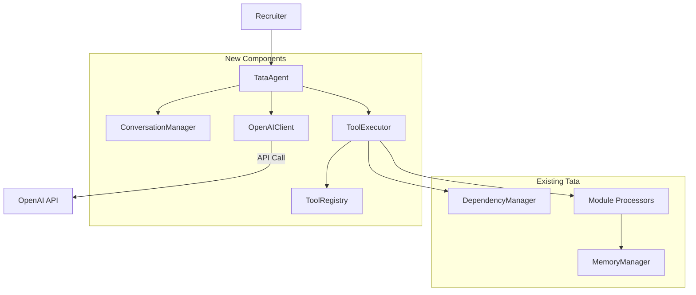
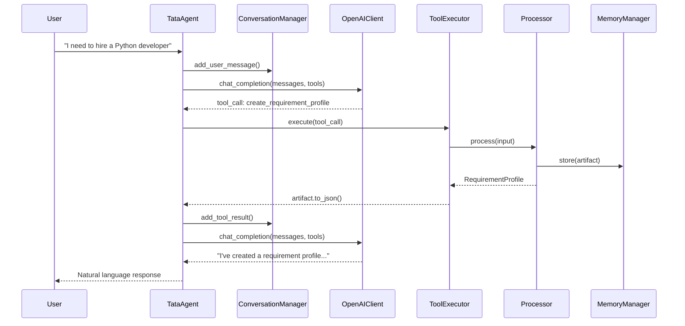

# Design Document: OpenAI Integration

## Overview

This design describes the integration of OpenAI's function calling API with Tata's existing module architecture. The integration follows a clean separation of concerns where OpenAI handles natural language understanding and intent detection, while Tata's existing processors handle all business logic, validation, and artifact management.

The architecture uses the Protocol pattern consistent with Tata's existing codebase, enabling dependency injection for testability and future extensibility.

## Architecture



### Request Flow



## Components and Interfaces

### ToolDefinition

Represents an OpenAI-compatible function definition.

```python
@dataclass
class ToolDefinition:
    """OpenAI function calling tool definition.
    
    Attributes:
        name: Function name (snake_case, matches processor)
        description: Human-readable description for OpenAI
        parameters: JSON Schema for function parameters
        module_type: Corresponding Tata ModuleType
    """
    name: str
    description: str
    parameters: Dict[str, Any]  # JSON Schema
    module_type: ModuleType
    
    def to_openai_format(self) -> Dict[str, Any]:
        """Convert to OpenAI tools array format."""
        return {
            "type": "function",
            "function": {
                "name": self.name,
                "description": self.description,
                "parameters": self.parameters
            }
        }
```

### ToolRegistry Protocol and Implementation

```python
class ToolRegistry(Protocol):
    """Protocol for managing tool definitions."""
    
    def get_tool(self, name: str) -> Optional[ToolDefinition]:
        """Get a tool definition by name."""
        ...
    
    def get_all_tools(self) -> List[ToolDefinition]:
        """Get all registered tools."""
        ...
    
    def get_openai_tools(self) -> List[Dict[str, Any]]:
        """Get all tools in OpenAI format."""
        ...


class InMemoryToolRegistry:
    """In-memory implementation of ToolRegistry.
    
    Registers all Tata modules as OpenAI-callable tools with
    appropriate parameter schemas derived from input dataclasses.
    """
    
    def __init__(self):
        self._tools: Dict[str, ToolDefinition] = {}
        self._register_default_tools()
    
    def _register_default_tools(self) -> None:
        """Register all Tata module tools."""
        # Each tool maps to a Tata module processor
        ...
```

### Message Types

```python
class MessageRole(Enum):
    """OpenAI message roles."""
    SYSTEM = "system"
    USER = "user"
    ASSISTANT = "assistant"
    TOOL = "tool"


@dataclass
class Message:
    """A conversation message.
    
    Attributes:
        role: The message role
        content: Text content (None for tool calls)
        tool_calls: List of tool calls (assistant only)
        tool_call_id: ID of tool call this responds to (tool only)
        name: Tool name (tool only)
    """
    role: MessageRole
    content: Optional[str] = None
    tool_calls: Optional[List[ToolCall]] = None
    tool_call_id: Optional[str] = None
    name: Optional[str] = None
    
    def to_openai_format(self) -> Dict[str, Any]:
        """Convert to OpenAI message format."""
        msg = {"role": self.role.value}
        if self.content is not None:
            msg["content"] = self.content
        if self.tool_calls:
            msg["tool_calls"] = [tc.to_dict() for tc in self.tool_calls]
        if self.tool_call_id:
            msg["tool_call_id"] = self.tool_call_id
        if self.name:
            msg["name"] = self.name
        return msg
    
    @classmethod
    def from_openai_format(cls, data: Dict[str, Any]) -> "Message":
        """Create Message from OpenAI response format."""
        ...


@dataclass
class ToolCall:
    """A tool call from OpenAI.
    
    Attributes:
        id: Unique identifier for this call
        name: Function name to call
        arguments: JSON string of arguments
    """
    id: str
    name: str
    arguments: str  # JSON string
    
    def to_dict(self) -> Dict[str, Any]:
        """Convert to dictionary format."""
        return {
            "id": self.id,
            "type": "function",
            "function": {
                "name": self.name,
                "arguments": self.arguments
            }
        }
    
    def parse_arguments(self) -> Dict[str, Any]:
        """Parse arguments JSON to dictionary."""
        return json.loads(self.arguments)
```

### ConversationManager Protocol and Implementation

```python
class ConversationManager(Protocol):
    """Protocol for managing conversation history."""
    
    def get_messages(self) -> List[Message]:
        """Get all messages in conversation."""
        ...
    
    def add_user_message(self, content: str) -> None:
        """Add a user message."""
        ...
    
    def add_assistant_message(self, content: str) -> None:
        """Add an assistant text response."""
        ...
    
    def add_assistant_tool_calls(self, tool_calls: List[ToolCall]) -> None:
        """Add an assistant message with tool calls."""
        ...
    
    def add_tool_result(self, tool_call_id: str, name: str, result: str) -> None:
        """Add a tool execution result."""
        ...
    
    def clear(self) -> None:
        """Clear conversation history (keeps system prompt)."""
        ...


class InMemoryConversationManager:
    """In-memory implementation of ConversationManager.
    
    Maintains conversation history with configurable token limit.
    System prompt is always preserved during truncation.
    """
    
    SYSTEM_PROMPT = """You are Tata, GlobalConnect's Talent Acquisition Team Assistant. 
You help recruiters with their recruitment workflow including:
- Creating requirement profiles for job positions
- Generating job advertisements
- Creating screening templates for interviews
- Writing headhunting messages for LinkedIn outreach
- Generating candidate and funnel reports
- Reviewing job ads for improvements
- Checking content for inclusive language

Always be helpful, professional, and focused on recruitment tasks.
When you need information to complete a task, ask the recruiter for it.
Never invent requirements or qualifications not provided by the recruiter."""

    def __init__(self, max_messages: int = 50):
        self._messages: List[Message] = []
        self._max_messages = max_messages
        self._init_system_prompt()
    
    def _init_system_prompt(self) -> None:
        """Initialize with system prompt."""
        self._messages.append(Message(
            role=MessageRole.SYSTEM,
            content=self.SYSTEM_PROMPT
        ))
```

### OpenAIClient Protocol and Implementation

```python
@dataclass
class ChatCompletionResponse:
    """Response from OpenAI chat completion.
    
    Attributes:
        content: Text content if no tool calls
        tool_calls: List of tool calls if any
        finish_reason: Why the response ended
    """
    content: Optional[str]
    tool_calls: Optional[List[ToolCall]]
    finish_reason: str


class OpenAIClient(Protocol):
    """Protocol for OpenAI API interactions."""
    
    def chat_completion(
        self,
        messages: List[Message],
        tools: Optional[List[Dict[str, Any]]] = None,
    ) -> ChatCompletionResponse:
        """Send chat completion request.
        
        Args:
            messages: Conversation history
            tools: Available tools in OpenAI format
            
        Returns:
            ChatCompletionResponse with content or tool calls
            
        Raises:
            OpenAIAPIError: If API call fails
        """
        ...


class OpenAIAPIError(Exception):
    """Raised when OpenAI API call fails."""
    pass


class RealOpenAIClient:
    """Production implementation using OpenAI SDK.
    
    Reads API key from OPENAI_API_KEY environment variable.
    """
    
    def __init__(
        self,
        model: str = "gpt-4o",
        api_key: Optional[str] = None,
        timeout: float = 30.0
    ):
        self._model = model
        self._api_key = api_key or os.environ.get("OPENAI_API_KEY")
        self._timeout = timeout
        self._client = OpenAI(api_key=self._api_key, timeout=timeout)
    
    def chat_completion(
        self,
        messages: List[Message],
        tools: Optional[List[Dict[str, Any]]] = None,
    ) -> ChatCompletionResponse:
        """Send chat completion request to OpenAI."""
        try:
            response = self._client.chat.completions.create(
                model=self._model,
                messages=[m.to_openai_format() for m in messages],
                tools=tools,
                tool_choice="auto" if tools else None,
            )
            
            choice = response.choices[0]
            message = choice.message
            
            tool_calls = None
            if message.tool_calls:
                tool_calls = [
                    ToolCall(
                        id=tc.id,
                        name=tc.function.name,
                        arguments=tc.function.arguments
                    )
                    for tc in message.tool_calls
                ]
            
            return ChatCompletionResponse(
                content=message.content,
                tool_calls=tool_calls,
                finish_reason=choice.finish_reason
            )
        except Exception as e:
            raise OpenAIAPIError(f"OpenAI API call failed: {e}") from e


class MockOpenAIClient:
    """Mock implementation for testing.
    
    Allows configuring predetermined responses for testing
    without making real API calls.
    """
    
    def __init__(self):
        self._responses: List[ChatCompletionResponse] = []
        self._call_history: List[Tuple[List[Message], Optional[List[Dict]]]] = []
    
    def set_responses(self, responses: List[ChatCompletionResponse]) -> None:
        """Set responses to return in order."""
        self._responses = list(responses)
    
    def chat_completion(
        self,
        messages: List[Message],
        tools: Optional[List[Dict[str, Any]]] = None,
    ) -> ChatCompletionResponse:
        """Return next configured response."""
        self._call_history.append((messages, tools))
        if self._responses:
            return self._responses.pop(0)
        return ChatCompletionResponse(
            content="Mock response",
            tool_calls=None,
            finish_reason="stop"
        )
```

### ToolExecutor

```python
@dataclass
class ToolExecutionResult:
    """Result of executing a tool.
    
    Attributes:
        success: Whether execution succeeded
        result: JSON string result on success
        error: Error message on failure
    """
    success: bool
    result: Optional[str] = None
    error: Optional[str] = None


class ToolExecutor:
    """Executes tool calls using Tata processors.
    
    Routes OpenAI tool calls to appropriate module processors,
    handles dependency checking, and manages artifact storage.
    """
    
    def __init__(
        self,
        tool_registry: ToolRegistry,
        dependency_manager: DependencyManager,
        memory_manager: MemoryManager,
        session_id: str
    ):
        self._registry = tool_registry
        self._deps = dependency_manager
        self._memory = memory_manager
        self._session_id = session_id
        self._processors = self._init_processors()
    
    def execute(self, tool_call: ToolCall) -> ToolExecutionResult:
        """Execute a tool call.
        
        Args:
            tool_call: The tool call from OpenAI
            
        Returns:
            ToolExecutionResult with success/failure and result/error
        """
        # 1. Validate tool exists
        tool = self._registry.get_tool(tool_call.name)
        if not tool:
            return ToolExecutionResult(
                success=False,
                error=f"Unknown tool: {tool_call.name}"
            )
        
        # 2. Check dependencies
        dep_check = self._deps.can_execute(self._session_id, tool.module_type)
        if not dep_check.can_proceed:
            return ToolExecutionResult(
                success=False,
                error=dep_check.message
            )
        
        # 3. Parse arguments and execute
        try:
            args = tool_call.parse_arguments()
            processor = self._processors.get(tool.module_type)
            if not processor:
                return ToolExecutionResult(
                    success=False,
                    error=f"No processor for module: {tool.module_type}"
                )
            
            result = processor.process(**args)
            
            # 4. Store artifact
            if hasattr(result, 'artifact_type'):
                self._memory.store(self._session_id, result)
            
            # 5. Return JSON result
            return ToolExecutionResult(
                success=True,
                result=result.to_json()
            )
            
        except Exception as e:
            return ToolExecutionResult(
                success=False,
                error=str(e)
            )
```

### TataAgent

```python
class TataAgent:
    """Main agent orchestrating conversation with OpenAI.
    
    Manages the conversation loop, tool execution, and
    response generation for natural language recruitment assistance.
    """
    
    def __init__(
        self,
        openai_client: OpenAIClient,
        tool_registry: ToolRegistry,
        tool_executor: ToolExecutor,
        conversation_manager: ConversationManager
    ):
        self._client = openai_client
        self._registry = tool_registry
        self._executor = tool_executor
        self._conversation = conversation_manager
    
    def chat(self, user_message: str) -> str:
        """Process a user message and return response.
        
        Args:
            user_message: The user's input
            
        Returns:
            Natural language response from the agent
        """
        # Add user message to history
        self._conversation.add_user_message(user_message)
        
        # Get available tools
        tools = self._registry.get_openai_tools()
        
        # Call OpenAI
        response = self._client.chat_completion(
            messages=self._conversation.get_messages(),
            tools=tools
        )
        
        # Handle tool calls if any
        while response.tool_calls:
            # Store assistant's tool call message
            self._conversation.add_assistant_tool_calls(response.tool_calls)
            
            # Execute each tool
            for tool_call in response.tool_calls:
                result = self._executor.execute(tool_call)
                
                # Add result to conversation
                result_content = result.result if result.success else f"Error: {result.error}"
                self._conversation.add_tool_result(
                    tool_call_id=tool_call.id,
                    name=tool_call.name,
                    result=result_content
                )
            
            # Get next response from OpenAI
            response = self._client.chat_completion(
                messages=self._conversation.get_messages(),
                tools=tools
            )
        
        # Store and return final text response
        if response.content:
            self._conversation.add_assistant_message(response.content)
            return response.content
        
        return "I apologize, but I couldn't generate a response. Please try again."
```

## Data Models

### Tool Parameter Schemas

Each Tata module maps to a tool with parameters derived from its input dataclass:

```python
# Example: RequirementProfile tool parameters
REQUIREMENT_PROFILE_PARAMS = {
    "type": "object",
    "properties": {
        "startup_notes": {
            "type": "string",
            "description": "Notes from the recruitment start-up meeting"
        },
        "position_title": {
            "type": "string",
            "description": "The job position title"
        },
        "old_job_ad": {
            "type": "string",
            "description": "Previous job advertisement for reference (optional)"
        },
        "hiring_manager_input": {
            "type": "string",
            "description": "Direct input from the hiring manager (optional)"
        }
    },
    "required": ["startup_notes", "position_title"]
}

# Example: JobAd tool parameters
JOB_AD_PARAMS = {
    "type": "object",
    "properties": {
        "tone": {
            "type": "string",
            "enum": ["formal", "casual", "friendly"],
            "description": "The tone of the job advertisement"
        },
        "include_salary": {
            "type": "boolean",
            "description": "Whether to include salary information"
        },
        "language": {
            "type": "string",
            "enum": ["en", "sv", "da", "no", "de"],
            "description": "Output language for the job ad"
        }
    },
    "required": []
}
```


## Correctness Properties

*A property is a characteristic or behavior that should hold true across all valid executions of a system—essentially, a formal statement about what the system should do. Properties serve as the bridge between human-readable specifications and machine-verifiable correctness guarantees.*

### Property 1: Tool Registry Schema Validity

*For any* tool definition in the registry, converting it to OpenAI format SHALL produce a valid JSON object with required fields: `type` = "function", `function.name` (non-empty string), `function.description` (string), and `function.parameters` (valid JSON Schema object).

**Validates: Requirements 1.1, 1.2**

### Property 2: Tool Registry Dependency Documentation

*For any* module with dependencies (JobAd, TAScreening, HMScreening, Headhunting, CandidateReport), the tool description SHALL contain the word "requires" or "depends" and mention the prerequisite module names.

**Validates: Requirements 1.4**

### Property 3: Message Serialization Round-Trip

*For any* valid Message object, converting to OpenAI format and back (`from_openai_format(msg.to_openai_format())`) SHALL produce an equivalent Message with the same role, content, tool_calls, and tool_call_id.

**Validates: Requirements 2.1**

### Property 4: Conversation Message Persistence

*For any* sequence of user messages, assistant messages, and tool results added to a ConversationManager, calling `get_messages()` SHALL return a list containing all added messages in order (after the system prompt).

**Validates: Requirements 2.3, 2.4**

### Property 5: Conversation Truncation Preserves System Prompt

*For any* ConversationManager with max_messages=N, after adding more than N messages, the first message in `get_messages()` SHALL always be the system prompt (role=SYSTEM).

**Validates: Requirements 2.6**

### Property 6: Tool Call Argument Parsing

*For any* ToolCall with valid JSON in the arguments field, calling `parse_arguments()` SHALL return a dictionary matching the original JSON structure.

**Validates: Requirements 3.1**

### Property 7: Unknown Tool Rejection

*For any* tool name not registered in the ToolRegistry, executing a ToolCall with that name SHALL return a ToolExecutionResult with `success=False` and an error message containing the unknown tool name.

**Validates: Requirements 3.2**

### Property 8: Dependency Enforcement

*For any* module with unsatisfied dependencies (required artifacts not in MemoryManager), executing a ToolCall for that module SHALL return a ToolExecutionResult with `success=False` and an error message listing the missing prerequisites.

**Validates: Requirements 3.3, 3.4**

### Property 9: Successful Execution Stores Artifact

*For any* ToolCall for a standalone module (no dependencies) with valid arguments, execution SHALL:
1. Return a ToolExecutionResult with `success=True`
2. Store the resulting artifact in MemoryManager (verifiable via `has_artifact()`)
3. Return valid JSON in the result field that can be parsed back

**Validates: Requirements 3.5, 3.6, 3.7**

### Property 10: Text Response Pass-Through

*For any* ChatCompletionResponse with `content` (text) and no `tool_calls`, the TataAgent SHALL return the content string unchanged.

**Validates: Requirements 4.2**

### Property 11: Error Message Descriptiveness

*For any* failed tool execution, the error message SHALL contain at least one of: the tool name, the missing dependency name, or the validation error description (not be a generic "error occurred" message).

**Validates: Requirements 6.2, 6.3**

## Error Handling

### Error Types

```python
class OpenAIIntegrationError(Exception):
    """Base exception for OpenAI integration errors."""
    pass


class OpenAIAPIError(OpenAIIntegrationError):
    """Raised when OpenAI API call fails.
    
    Attributes:
        status_code: HTTP status code if available
        message: Error message from API
    """
    def __init__(self, message: str, status_code: Optional[int] = None):
        super().__init__(message)
        self.status_code = status_code
        self.message = message


class ToolNotFoundError(OpenAIIntegrationError):
    """Raised when requested tool doesn't exist."""
    pass


class ToolExecutionError(OpenAIIntegrationError):
    """Raised when tool execution fails.
    
    Attributes:
        tool_name: Name of the failed tool
        cause: Original exception that caused failure
    """
    def __init__(self, tool_name: str, cause: Exception):
        super().__init__(f"Tool '{tool_name}' failed: {cause}")
        self.tool_name = tool_name
        self.cause = cause


class DependencyError(OpenAIIntegrationError):
    """Raised when module dependencies are not satisfied.
    
    Attributes:
        module: The module that couldn't execute
        missing: List of missing prerequisite modules
    """
    def __init__(self, module: ModuleType, missing: List[ModuleType]):
        missing_names = [m.name for m in missing]
        super().__init__(
            f"Cannot execute {module.name}: requires {', '.join(missing_names)}"
        )
        self.module = module
        self.missing = missing
```

### Error Handling Strategy

1. **API Errors**: Catch OpenAI SDK exceptions, wrap in `OpenAIAPIError`, log full details, return user-friendly message
2. **Tool Errors**: Return `ToolExecutionResult` with `success=False` and descriptive error
3. **Validation Errors**: Propagate validation messages from processors to user
4. **Unexpected Errors**: Log full stack trace, return generic "please try again" message

## Testing Strategy

### Unit Tests

Unit tests verify individual components in isolation using mocks:

- **ToolRegistry**: Test tool registration, retrieval, OpenAI format conversion
- **ConversationManager**: Test message addition, retrieval, truncation
- **ToolExecutor**: Test routing, dependency checking, error handling (with mock processors)
- **Message/ToolCall**: Test serialization/deserialization

### Property-Based Tests

Property tests use Hypothesis to verify universal properties across many inputs:

```python
# Example: Property 3 - Message Round-Trip
@given(
    role=st.sampled_from(list(MessageRole)),
    content=st.text(min_size=0, max_size=1000),
)
@settings(max_examples=100)
def test_message_round_trip(role, content):
    """Property 3: Message serialization round-trip."""
    msg = Message(role=role, content=content)
    openai_format = msg.to_openai_format()
    restored = Message.from_openai_format(openai_format)
    assert restored.role == msg.role
    assert restored.content == msg.content
```

### Integration Tests

Integration tests verify end-to-end flows with real OpenAI API:

```python
@pytest.mark.integration
def test_create_requirement_profile_flow():
    """Test full conversation flow for creating a requirement profile."""
    agent = create_agent_with_real_client()
    
    response = agent.chat(
        "I need to hire a senior Python developer for our backend team. "
        "Must have 5+ years Python, Django experience, and AWS knowledge."
    )
    
    # Verify response mentions profile creation
    assert "profile" in response.lower() or "requirement" in response.lower()
    
    # Verify artifact was stored
    assert agent._executor._memory.has_artifact(
        agent._executor._session_id,
        ArtifactType.REQUIREMENT_PROFILE
    )
```

### Test Configuration

```python
# tests/conftest.py additions

@pytest.fixture
def mock_openai_client():
    """Provide mock OpenAI client for unit tests."""
    return MockOpenAIClient()

@pytest.fixture
def real_openai_client():
    """Provide real OpenAI client for integration tests."""
    api_key = os.environ.get("OPENAI_API_KEY")
    if not api_key:
        pytest.skip("OPENAI_API_KEY not set")
    return RealOpenAIClient(api_key=api_key)

# pytest.ini marker
# [pytest]
# markers =
#     integration: marks tests as integration tests (deselect with '-m "not integration"')
```

### Test File Structure

```
tests/
├── test_openai_integration.py      # Unit tests for all components
├── test_openai_properties.py       # Property-based tests
└── test_openai_e2e.py              # Integration tests with real API
```
