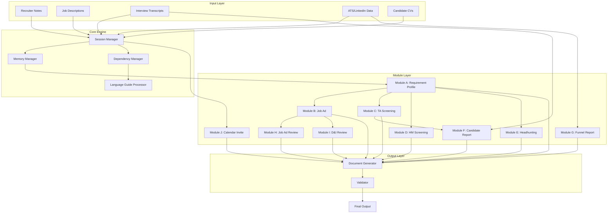

# Design Document: Tata Recruitment Assistant

## Overview

Tata is a conversational AI assistant designed to support GlobalConnect's Talent Acquisition team through the entire recruitment lifecycle. The system operates as a stateful chat application where each session represents one recruitment project. The architecture follows a modular design with clear dependencies between components, ensuring data consistency and reusability across the recruitment workflow.

The system processes recruiter inputs (start-up notes, job descriptions, interview transcripts, ATS data) and generates structured outputs (requirement profiles, job ads, screening templates, candidate reports) while maintaining compliance with GlobalConnect's language guidelines and inclusive hiring practices.

## Architecture



## Components and Interfaces

### 1. Session Manager

Manages the lifecycle of a recruitment chat session.

```python
from dataclasses import dataclass
from datetime import datetime
from enum import Enum
from typing import Optional, Protocol
from abc import abstractmethod

class SupportedLanguage(Enum):
    """Languages Tata can output"""
    ENGLISH = "en"
    SWEDISH = "sv"
    DANISH = "da"
    NORWEGIAN = "no"
    GERMAN = "de"

class ModuleType(Enum):
    """Different modules in Tata"""
    REQUIREMENT_PROFILE = "A"
    JOB_AD = "B"
    TA_SCREENING = "C"
    HM_SCREENING = "D"
    HEADHUNTING = "E"
    CANDIDATE_REPORT = "F"
    FUNNEL_REPORT = "G"
    JOB_AD_REVIEW = "H"
    DI_REVIEW = "I"
    CALENDAR_INVITE = "J"

@dataclass
class Session:
    """Represents a recruitment chat session"""
    id: str
    position_name: str
    language: SupportedLanguage
    created_at: datetime
    last_activity: datetime
    current_module: Optional[ModuleType]

class SessionManager(Protocol):
    """Manages recruitment chat sessions"""
    
    @abstractmethod
    def create_session(self, recruiter_id: str) -> Session:
        """Create a new session for a recruiter"""
        ...
    
    @abstractmethod
    def get_session(self, session_id: str) -> Optional[Session]:
        """Retrieve an existing session"""
        ...
    
    @abstractmethod
    def set_position_name(self, session_id: str, position_name: str) -> None:
        """Set the position name for a session"""
        ...
    
    @abstractmethod
    def get_active_module(self, session_id: str) -> Optional[ModuleType]:
        """Get the currently active module"""
        ...
    
    @abstractmethod
    def set_language(self, session_id: str, language: SupportedLanguage) -> None:
        """Set the output language for a session"""
        ...
```

### 2. Memory Manager

Stores and retrieves all artifacts created during a session.

```python
from enum import Enum
from typing import Protocol, Optional, Dict, Any
from abc import abstractmethod
import json

class ArtifactType(Enum):
    """Different artifact types stored in memory"""
    REQUIREMENT_PROFILE = "requirement_profile"
    JOB_AD = "job_ad"
    TA_SCREENING_TEMPLATE = "ta_screening_template"
    HM_SCREENING_TEMPLATE = "hm_screening_template"
    HEADHUNTING_MESSAGES = "headhunting_messages"
    CANDIDATE_REPORTS = "candidate_reports"
    FUNNEL_REPORT = "funnel_report"
    JOB_AD_REVIEW = "job_ad_review"
    DI_REVIEW = "di_review"
    CALENDAR_INVITE = "calendar_invite"

class Artifact(Protocol):
    """Interface all storable artifacts must implement"""
    
    @property
    def artifact_type(self) -> ArtifactType:
        """Return the artifact type"""
        ...
    
    def to_json(self) -> str:
        """Serialize to JSON"""
        ...

class MemoryManager(Protocol):
    """Stores and retrieves artifacts for sessions"""
    
    @abstractmethod
    def store(self, session_id: str, artifact_type: ArtifactType, data: Artifact) -> None:
        """Store an artifact for a session"""
        ...
    
    @abstractmethod
    def retrieve(self, session_id: str, artifact_type: ArtifactType) -> Optional[Artifact]:
        """Retrieve an artifact from a session"""
        ...
    
    @abstractmethod
    def has_artifact(self, session_id: str, artifact_type: ArtifactType) -> bool:
        """Check if an artifact exists"""
        ...
    
    @abstractmethod
    def get_all_artifacts(self, session_id: str) -> Dict[ArtifactType, Artifact]:
        """Get all artifacts for a session"""
        ...
```

### 3. Dependency Manager

Enforces module dependencies and determines required prerequisites.

```python
from dataclasses import dataclass
from typing import List, Protocol
from abc import abstractmethod

@dataclass
class DependencyCheck:
    """Result of checking module dependencies"""
    can_proceed: bool
    missing_dependencies: List[ModuleType]
    message: str

class DependencyManager(Protocol):
    """Enforces module dependencies"""
    
    @abstractmethod
    def can_execute(self, session_id: str, module: ModuleType) -> DependencyCheck:
        """Check if a module can be executed"""
        ...
    
    @abstractmethod
    def get_required_modules(self, module: ModuleType) -> List[ModuleType]:
        """Get required modules for a given module"""
        ...
    
    @abstractmethod
    def is_standalone(self, module: ModuleType) -> bool:
        """Check if a module has no dependencies"""
        ...

# Module dependencies map
MODULE_DEPENDENCIES: Dict[ModuleType, List[ModuleType]] = {
    ModuleType.REQUIREMENT_PROFILE: [],                                    # A - no dependencies
    ModuleType.JOB_AD: [ModuleType.REQUIREMENT_PROFILE],                   # B requires A
    ModuleType.TA_SCREENING: [ModuleType.REQUIREMENT_PROFILE],             # C requires A
    ModuleType.HM_SCREENING: [ModuleType.REQUIREMENT_PROFILE],             # D requires A
    ModuleType.HEADHUNTING: [ModuleType.REQUIREMENT_PROFILE],              # E requires A
    ModuleType.CANDIDATE_REPORT: [ModuleType.REQUIREMENT_PROFILE, ModuleType.TA_SCREENING],  # F requires A, C
    ModuleType.FUNNEL_REPORT: [],                                          # G - standalone
    ModuleType.JOB_AD_REVIEW: [],                                          # H - standalone
    ModuleType.DI_REVIEW: [],                                              # I - standalone
    ModuleType.CALENDAR_INVITE: [],                                        # J - standalone
}
```

### 4. Language Guide Processor

Applies GlobalConnect's language guidelines to all outputs.

```python
from dataclasses import dataclass
from typing import List, Protocol
from enum import Enum
from abc import abstractmethod

@dataclass
class BannedWordViolation:
    """A single banned word found in text"""
    word: str
    suggestion: str
    position: int

@dataclass
class BannedWordCheck:
    """Result of checking for banned words"""
    has_banned_words: bool
    violations: List[BannedWordViolation]

@dataclass
class GCFactProposal:
    """A proposed GlobalConnect fact"""
    fact: str
    source: str
    requires_approval: bool

class GermanFormality(Enum):
    """du/Sie formality in German"""
    DU = "du"
    SIE = "Sie"

class LanguageGuideProcessor(Protocol):
    """Applies GC language guidelines"""
    
    @abstractmethod
    def apply_style_guide(self, text: str, language: SupportedLanguage) -> str:
        """Apply style guide to text"""
        ...
    
    @abstractmethod
    def check_banned_words(self, text: str, language: SupportedLanguage) -> BannedWordCheck:
        """Check text for banned words"""
        ...
    
    @abstractmethod
    def propose_gc_facts(self, context: str) -> List[GCFactProposal]:
        """Propose GlobalConnect facts for context"""
        ...
    
    @abstractmethod
    def get_german_formality(self, context: str) -> GermanFormality:
        """Determine du/Sie formality for German"""
        ...
```

### 5. Module Processors

Each module has a dedicated processor implementing a common interface.

```python
from dataclasses import dataclass, field
from typing import List, Optional, Generic, TypeVar, Protocol
from datetime import datetime
from abc import abstractmethod

@dataclass
class ValidationError:
    field: str
    message: str

@dataclass
class ValidationWarning:
    field: str
    message: str

@dataclass
class ValidationResult:
    """Result of input validation"""
    is_valid: bool
    errors: List[ValidationError] = field(default_factory=list)
    warnings: List[ValidationWarning] = field(default_factory=list)

TInput = TypeVar('TInput')
TOutput = TypeVar('TOutput')

class ModuleProcessor(Protocol[TInput, TOutput]):
    """Interface all module processors implement"""
    
    @abstractmethod
    def validate(self, input_data: TInput) -> ValidationResult:
        """Validate input data"""
        ...
    
    @abstractmethod
    def process(self, session_id: str, input_data: TInput) -> TOutput:
        """Process input and generate output"""
        ...
    
    @abstractmethod
    def get_required_inputs(self) -> List[str]:
        """Get list of required input fields"""
        ...
    
    @abstractmethod
    def get_optional_inputs(self) -> List[str]:
        """Get list of optional input fields"""
        ...
```

#### Module A: Requirement Profile

```python
from dataclasses import dataclass, field
from typing import List, Optional, Tuple

@dataclass
class RequirementProfileInput:
    """Input for creating a requirement profile"""
    startup_notes: str
    old_job_ad: Optional[str] = None
    hiring_manager_input: Optional[str] = None

@dataclass
class TeamInfo:
    """Team-related information"""
    size: int
    location: str
    collaboration_style: str

@dataclass
class RequirementProfile:
    """Core artifact for a recruitment"""
    position_title: str
    must_have_skills: Tuple[str, str, str, str]  # Exactly 4 must-haves
    primary_responsibilities: List[str]
    good_to_haves: List[str] = field(default_factory=list)
    soft_skills: List[str] = field(default_factory=list)
    motivations: List[str] = field(default_factory=list)
    team_info: Optional[TeamInfo] = None
    bu_description: Optional[str] = None
    
    @property
    def artifact_type(self) -> ArtifactType:
        return ArtifactType.REQUIREMENT_PROFILE
    
    def to_json(self) -> str:
        import json
        return json.dumps(self.__dict__, default=str)
```

#### Module B: Job Ad

```python
@dataclass
class RequirementsSection:
    """Requirements part of a job ad"""
    must_haves: Tuple[str, str, str, str]
    soft_skills: str
    good_to_haves: str

@dataclass
class JobAdInput:
    """Input for creating a job ad"""
    requirement_profile: RequirementProfile
    startup_notes: str
    old_job_ad: Optional[str] = None

@dataclass
class JobAd:
    """Complete job advertisement"""
    headline: str
    intro: str
    role_description: str
    the_why: str
    responsibilities: List[str]  # 3-5 items
    requirements: RequirementsSection
    soft_skills_paragraph: str
    team_and_why_gc: str
    process: str
    ending: str
    
    @property
    def artifact_type(self) -> ArtifactType:
        return ArtifactType.JOB_AD
    
    def to_json(self) -> str:
        import json
        return json.dumps(self.__dict__, default=str)
```

#### Module C/D: Screening Templates

```python
class SkillType(Enum):
    """Categorizes skills for question generation"""
    TECHNICAL = "technical"
    LEADERSHIP = "leadership"
    FUNCTIONAL = "functional"
    GOOD_TO_HAVE = "good_to_have"

@dataclass
class Question:
    """An interview question"""
    text: str

@dataclass
class SkillQuestionSet:
    """Questions for a specific skill"""
    skill_name: str
    skill_type: SkillType
    main_question: str
    follow_up_questions: List[str]  # 2-3 follow-ups
    notes_space: bool = False  # For HM template

@dataclass
class ScreeningTemplateInput:
    """Input for creating screening templates"""
    requirement_profile: RequirementProfile
    include_good_to_haves: bool = False
    additional_areas: List[str] = field(default_factory=list)
    include_role_intro: bool = False

@dataclass
class ScreeningTemplate:
    """Interview template artifact"""
    role_intro: Optional[str]
    motivation_questions: List[Question]
    skill_questions: List[SkillQuestionSet]
    practical_questions: List[Question]
    closing_guidance: str
    is_hm_template: bool = False
    
    @property
    def artifact_type(self) -> ArtifactType:
        return ArtifactType.HM_SCREENING_TEMPLATE if self.is_hm_template else ArtifactType.TA_SCREENING_TEMPLATE
    
    def to_json(self) -> str:
        import json
        return json.dumps(self.__dict__, default=str)
```

#### Module E: Headhunting Messages

```python
@dataclass
class HeadhuntingInput:
    """Input for creating headhunting messages"""
    requirement_profile: RequirementProfile
    job_ad: Optional[JobAd] = None
    candidate_profile: Optional[str] = None  # LinkedIn profile

@dataclass
class MultiLanguageMessage:
    """Message in all supported languages"""
    en: str
    sv: str
    da: str
    no: str
    de_du: str  # German informal
    de_sie: str  # German formal

@dataclass
class HeadhuntingMessages:
    """All three message versions"""
    short_direct: MultiLanguageMessage
    value_proposition: MultiLanguageMessage
    call_to_action: MultiLanguageMessage
    
    @property
    def artifact_type(self) -> ArtifactType:
        return ArtifactType.HEADHUNTING_MESSAGES
    
    def to_json(self) -> str:
        import json
        return json.dumps(self.__dict__, default=str)
```

#### Module F: Candidate Report

```python
class Rating(Enum):
    """1-5 skill rating"""
    VERY_BAD = 1        # No relevant points
    UNSATISFACTORY = 2  # Weak, missing key elements
    OKAY = 3            # Meets minimum expectations
    GOOD = 4            # Strong, missing minor details
    EXCELLENT = 5       # Fully relevant and strong

RATING_DESCRIPTIONS = {
    Rating.VERY_BAD: "Very bad - no relevant points",
    Rating.UNSATISFACTORY: "Unsatisfactory - weak, missing key elements",
    Rating.OKAY: "Okay - meets minimum expectations",
    Rating.GOOD: "Good - strong, missing minor details",
    Rating.EXCELLENT: "Excellent - fully relevant and strong",
}

@dataclass
class SkillAssessment:
    """Assessment of a single skill"""
    skill_name: str
    summary: str
    examples: List[str]
    rating: Rating
    rating_explanation: str

@dataclass
class PracticalDetails:
    """Practical information about a candidate"""
    notice_period: str
    salary_expectation: str
    location: str
    languages: List[str]

class Recommendation(Enum):
    """Overall recommendation for a candidate"""
    RECOMMENDED = "Recommended"
    NOT_RECOMMENDED = "Not Recommended"
    BORDERLINE = "Borderline"

@dataclass
class CandidateReportInput:
    """Input for creating candidate reports"""
    transcript: str
    screening_template: ScreeningTemplate
    requirement_profile: RequirementProfile
    candidate_cv: Optional[str] = None

@dataclass
class CandidateReport:
    """Complete candidate assessment"""
    candidate_initials: str
    position_name: str
    interview_date: datetime
    recommendation: Recommendation
    professional_background: str
    motivation_assessment: SkillAssessment
    skill_assessments: List[SkillAssessment]
    practical_details: PracticalDetails
    risks_and_considerations: List[str]
    conclusion: str
    
    @property
    def artifact_type(self) -> ArtifactType:
        return ArtifactType.CANDIDATE_REPORTS
    
    def to_json(self) -> str:
        import json
        return json.dumps(self.__dict__, default=str)
```

#### Module G: Funnel Report

```python
@dataclass
class AttractionMetrics:
    job_ad_views: int
    apply_clicks: int
    applications_received: int
    qualified_applications: int
    candidates_sourced: int
    candidates_contacted: int
    candidates_replied: int
    candidates_interested: int

@dataclass
class ProcessMetrics:
    ta_screenings: int
    hm_interviews: int
    case_interviews: int
    team_interviews: int
    tests: int
    references: int
    offers_made: int
    offers_accepted: int
    offers_rejected: int

@dataclass
class TimeMetrics:
    time_in_stage: Dict[str, int]  # stage name -> days
    time_to_fill: int  # total days

@dataclass
class FunnelReportInput:
    """Input for creating funnel reports"""
    job_title: str
    number_of_positions: int
    hiring_manager_name: str
    locations: List[str]
    attraction_data: Optional[AttractionMetrics] = None
    process_data: Optional[ProcessMetrics] = None
    time_metrics: Optional[TimeMetrics] = None

@dataclass
class FunnelStage:
    """Single stage in the funnel"""
    name: str
    count: int
    conversion_from_previous: float
    cumulative_conversion: float
    time_in_stage: Optional[int] = None  # in days
    notes: Optional[str] = None

@dataclass
class Bottleneck:
    """Identified bottleneck"""
    stage: str
    conversion_rate: float
    time_in_stage: Optional[int]
    severity: str  # "high", "medium", "low"

@dataclass
class SuggestedFix:
    """Recommended fix for a bottleneck"""
    bottleneck: str
    fix: str
    owner: str  # "recruiter", "hiring_manager", "ta_operations"
    related_module: Optional[ModuleType] = None

@dataclass
class FunnelVisualization:
    """Data for visual representation"""
    stages: List[FunnelStage]
    largest_drops: List[str]  # top 2 drops

@dataclass
class FunnelReport:
    """Complete funnel analysis"""
    summary: str
    funnel_table: List[FunnelStage]
    bottlenecks: List[Bottleneck]
    suggested_fixes: List[SuggestedFix]
    visual_data: FunnelVisualization
    
    @property
    def artifact_type(self) -> ArtifactType:
        return ArtifactType.FUNNEL_REPORT
    
    def to_json(self) -> str:
        import json
        return json.dumps(self.__dict__, default=str)
```

#### Module I: D&I Review

```python
class BiasCategory(Enum):
    """Categories of bias to check"""
    GENDER = "gender"
    AGE = "age"
    DISABILITY = "disability"
    NATIONALITY = "nationality"
    FAMILY = "family"
    SOCIOECONOMIC = "socioeconomic"
    READABILITY = "readability"
    REQUIREMENTS = "requirements"
    GERMAN_TITLE = "german_title"
    LOCATION = "location"

class Severity(Enum):
    """Severity of a flagged item"""
    LOW = "low"
    MEDIUM = "medium"
    HIGH = "high"

@dataclass
class FlaggedItem:
    """Biased term found in text"""
    text: str
    category: BiasCategory
    severity: Severity
    explanation: str
    alternatives: List[str]

@dataclass
class CategoryScore:
    """Score for a single bias category"""
    category: BiasCategory
    score: int  # 0-100

@dataclass
class DIReviewInput:
    """Input for D&I review"""
    job_ad_text: str
    language: SupportedLanguage

@dataclass
class DIReview:
    """Complete D&I review result"""
    overall_score: int
    category_scores: List[CategoryScore]
    flagged_items: List[FlaggedItem]
    suggested_alternatives: List[FlaggedItem]
    compliance_notes: List[str]
    original_text: str  # preserved, never modified
    
    @property
    def artifact_type(self) -> ArtifactType:
        return ArtifactType.DI_REVIEW
    
    def to_json(self) -> str:
        import json
        return json.dumps(self.__dict__, default=str)
```

#### Module J: Calendar Invitation

```python
@dataclass
class PersonInfo:
    """Information about a person"""
    name: str
    title: str
    linkedin: Optional[str] = None

class LocationType(Enum):
    """Interview location type"""
    TEAMS = "teams"
    ONSITE = "onsite"

class City(Enum):
    """Office cities"""
    STOCKHOLM = "stockholm"
    COPENHAGEN = "copenhagen"
    OSLO = "oslo"

class InterviewType(Enum):
    """Type of interview"""
    HIRING_MANAGER = "hiring_manager"
    CASE = "case"

class BookingMethod(Enum):
    """How the interview is booked"""
    JOBYLON = "jobylon"
    MANUAL = "manual"

@dataclass
class ManualDateTime:
    """Date and time for manual booking"""
    date: str  # e.g., "Monday, 15 January"
    time: str  # e.g., "14:00"

@dataclass
class CalendarInviteInput:
    """Input for creating calendar invites"""
    position_name: str
    hiring_manager: PersonInfo
    recruiter_name: str
    location_type: LocationType
    interview_type: InterviewType
    duration: int  # 60 or 90 minutes
    booking_method: BookingMethod
    job_ad_link: Optional[str] = None
    additional_participants: List[PersonInfo] = field(default_factory=list)
    city: Optional[City] = None  # required if LocationType is onsite
    manual_date_time: Optional[ManualDateTime] = None  # required if BookingMethod is manual
    agenda: Optional[str] = None

@dataclass
class CalendarInvite:
    """Generated invitation text"""
    subject: str
    body: str
    candidate_placeholder: str = "[Candidate]"
    
    @property
    def artifact_type(self) -> ArtifactType:
        return ArtifactType.CALENDAR_INVITE
    
    def to_json(self) -> str:
        import json
        return json.dumps(self.__dict__, default=str)
```

### 6. Document Generator

Produces final formatted outputs.

```python
class OutputFormat(Enum):
    """Output format type"""
    WORD = "word"
    MARKDOWN = "markdown"
    PLAIN_TEXT = "plain_text"

@dataclass
class ComparisonTable:
    """Table comparing multiple candidates"""
    headers: List[str]
    rows: List[List[str]]

class DocumentGenerator(Protocol):
    """Produces formatted outputs"""
    
    @abstractmethod
    def generate_word_ready(self, artifact: Artifact, format: OutputFormat) -> str:
        """Generate Word-ready output"""
        ...
    
    @abstractmethod
    def generate_comparison(self, reports: List[CandidateReport]) -> ComparisonTable:
        """Generate candidate comparison table"""
        ...
    
    @abstractmethod
    def generate_visual(self, funnel_data: FunnelReport) -> FunnelVisualization:
        """Generate funnel visualization"""
        ...
```

### 7. Validator

Ensures all outputs meet quality standards.

```python
class Validator(Protocol):
    """Ensures outputs meet quality standards"""
    
    @abstractmethod
    def validate_against_profile(self, output: Artifact, profile: RequirementProfile) -> ValidationResult:
        """Validate output against requirement profile"""
        ...
    
    @abstractmethod
    def validate_language_compliance(self, text: str, language: SupportedLanguage) -> ValidationResult:
        """Validate language compliance"""
        ...
    
    @abstractmethod
    def validate_must_have_visibility(self, output: Artifact, must_haves: Tuple[str, str, str, str]) -> ValidationResult:
        """Validate must-haves are visible"""
        ...
    
    @abstractmethod
    def validate_no_banned_words(self, text: str) -> ValidationResult:
        """Validate no banned words present"""
        ...
```

## Data Models

### Core Entities

```python
@dataclass
class Skill:
    """Skill with categorization"""
    name: str
    skill_type: SkillType
    is_must_have: bool
    description: Optional[str] = None

@dataclass
class QuestionTemplate:
    """Templates for generating questions"""
    skill_type: SkillType
    main_question_template: str
    follow_up_templates: List[str]

@dataclass
class OfficeLocation:
    """Office address information"""
    city: City
    address: str
    maps_link: str

# GlobalConnect office locations
OFFICE_LOCATIONS: Dict[City, OfficeLocation] = {
    City.STOCKHOLM: OfficeLocation(
        city=City.STOCKHOLM,
        address="Solnavägen 3H, 113 63 Stockholm",
        maps_link="https://maps.app.goo.gl/TovPnSKBtW5MchH79",
    ),
    City.COPENHAGEN: OfficeLocation(
        city=City.COPENHAGEN,
        address="Havneholmen 6, 2450 København SV",
        maps_link="https://maps.app.goo.gl/UEk4qiah1CCsvSWZ7",
    ),
    City.OSLO: OfficeLocation(
        city=City.OSLO,
        address="Snarøyveien 36, 1364 Fornebu, Norway",
        maps_link="https://maps.app.goo.gl/Vu2iwSCthqhGvycU6",
    ),
}

@dataclass
class BiasWordPool:
    """Bias words for a specific language"""
    language: SupportedLanguage
    agentic_words: List[str]
    communal_words: List[str]
    age_coded_phrases: List[str]
    ableist_terms: Dict[str, str]  # term -> replacement
    exclusionary_barriers: List[str]
```

### Serialization

All artifacts implement the Artifact protocol and can be serialized to JSON.

```python
from dataclasses import dataclass, asdict
from datetime import datetime
import json

@dataclass
class SerializableArtifact:
    """Wraps an artifact with metadata"""
    artifact_type: ArtifactType
    version: str
    created_at: datetime
    updated_at: datetime
    data: Artifact
    
    def to_json(self) -> str:
        """Serialize the artifact to JSON"""
        return json.dumps(asdict(self), default=str)
    
    def to_word_ready(self) -> str:
        """Generate Word-ready text output"""
        # Implementation depends on artifact type
        return ""
```

## Correctness Properties

*A property is a characteristic or behavior that should hold true across all valid executions of a system—essentially, a formal statement about what the system should do. Properties serve as the bridge between human-readable specifications and machine-verifiable correctness guarantees.*

### Property 1: Memory Persistence Invariant

*For any* session and any artifact stored in that session, retrieving the artifact at any later point in the session SHALL return data equivalent to what was stored.

**Validates: Requirements 1.1, 1.5**

### Property 2: Artifact Reuse in Dependencies

*For any* session where a requirement profile exists, all subsequent module outputs (job ad, screening templates, headhunting messages, candidate reports) SHALL contain data derived from that same profile without re-requesting it.

**Validates: Requirements 1.2, 1.3, 1.4, 3.1**

### Property 3: Language Consistency

*For any* session where a language has been set, all subsequent outputs SHALL be in that language, and for German outputs, du/Sie formality SHALL be consistent throughout.

**Validates: Requirements 2.2, 2.8**

### Property 4: Style Guide Compliance

*For any* output text, it SHALL conform to the patterns and terminology defined in the GC AI Language Guide.

**Validates: Requirements 2.3, 13.4**

### Property 5: No Emojis

*For any* output text, it SHALL contain zero emoji characters.

**Validates: Requirements 2.5**

### Property 6: No Dash Bullets

*For any* output text containing bullet points, none SHALL use dash-style formatting (- or –).

**Validates: Requirements 2.6**

### Property 7: No Banned Words

*For any* candidate-facing output (job ads, headhunting messages, calendar invites), it SHALL contain zero words from the banned words list.

**Validates: Requirements 2.7, 7.5, 13.5**

### Property 8: Dependency Enforcement

*For any* module that requires a requirement profile (B, C, D, E, F), attempting to execute without a profile SHALL either fail with a dependency error or trigger profile creation first.

**Validates: Requirements 3.2, 5.1**

### Property 9: No Module Naming Exposure

*For any* user-facing output or message, it SHALL NOT contain module letter references (Module A, Module B, etc.).

**Validates: Requirements 3.5**

### Property 10: Four Must-Haves Invariant

*For any* requirement profile, it SHALL contain exactly four must-have skills, and these four skills SHALL be visible in all dependent outputs (job ads, screening templates).

**Validates: Requirements 4.1, 6.1, 13.3**

### Property 11: No Invented Content

*For any* output, all requirements, responsibilities, and skills mentioned SHALL be traceable to recruiter-provided input (start-up notes, old job ads, hiring manager input).

**Validates: Requirements 4.6, 13.2**

### Property 12: Output Structure Validation

*For any* module output, it SHALL contain all required sections as defined in the module specification (e.g., job ad must have headline, intro, role description, responsibilities, requirements, etc.).

**Validates: Requirements 5.2, 6.5, 8.5, 10.5, 11.6**

### Property 13: Question Generation Structure

*For any* skill in a screening template, there SHALL be exactly 1 main question and between 2-3 follow-up questions, and the question style SHALL match the skill type (technical, leadership, functional, good-to-have).

**Validates: Requirements 6.3, 6.4**

### Property 14: HM Template Notes Space

*For any* hiring manager screening template, every question SHALL be followed by a notes space placeholder.

**Validates: Requirements 6.7**

### Property 15: Three Headhunting Versions

*For any* headhunting message generation, the output SHALL contain exactly three versions: short & direct, value-proposition, and call-to-action.

**Validates: Requirements 7.1**

### Property 16: Multi-Language Availability

*For any* headhunting message set, each of the three versions SHALL be available in all five supported languages (English, Swedish, Danish, Norwegian, German with du and Sie variants).

**Validates: Requirements 7.2**

### Property 17: Message Length Constraint

*For any* headhunting message (first contact), the word count SHALL be less than 100.

**Validates: Requirements 7.3**

### Property 18: Personalization When Profile Provided

*For any* headhunting message generation where a candidate LinkedIn profile is provided, at least one detail from that profile SHALL appear in the personalized message.

**Validates: Requirements 7.4**

### Property 19: Message Structure Completeness

*For any* headhunting message, it SHALL contain a role hook, one value proposition, and a call to action.

**Validates: Requirements 7.6**

### Property 20: Rating Validity

*For any* skill assessment in a candidate report, the rating SHALL be an integer between 1 and 5 inclusive, and SHALL have a non-empty explanation string.

**Validates: Requirements 8.4**

### Property 21: Candidate Anonymization

*For any* candidate comparison table, candidate identifiers SHALL be initials only (2-3 characters), not full names.

**Validates: Requirements 8.7**

### Property 22: Conversion Rate Calculation

*For any* funnel stage transition, the conversion rate SHALL equal (count at stage B / count at stage A) × 100, rounded appropriately.

**Validates: Requirements 9.2**

### Property 23: Bottleneck Identification

*For any* funnel report, stages with conversion rates below a threshold (e.g., 30%) or time-in-stage above threshold SHALL be flagged as bottlenecks.

**Validates: Requirements 9.3**

### Property 24: Fix and Owner Assignment

*For any* identified bottleneck in a funnel report, there SHALL be exactly one suggested fix and one assigned owner.

**Validates: Requirements 9.6**

### Property 25: Bias Category Coverage

*For any* D&I review, the assessment SHALL check against all defined bias categories (gender, age, disability, nationality, family, socioeconomic, readability, requirements, german_title if applicable, location).

**Validates: Requirements 10.1, 10.6**

### Property 26: Flagged Items With Alternatives

*For any* flagged item in a D&I review, there SHALL be at least one suggested alternative wording.

**Validates: Requirements 10.2, 10.3**

### Property 27: No Automatic Changes

*For any* D&I review output, the original job ad text SHALL remain unchanged; only suggestions SHALL be provided separately.

**Validates: Requirements 10.4**

### Property 28: Office Address Correctness

*For any* on-site calendar invitation, the address and map link SHALL match the selected city from the predefined office locations.

**Validates: Requirements 11.2**

### Property 29: Conditional Content - Booking Method

*For any* calendar invitation with Jobylon booking, the booking link instruction SHALL be present; for manual booking, the specific date and time SHALL be present.

**Validates: Requirements 11.3, 11.4**

### Property 30: Candidate Name Placement

*For any* calendar invitation, the candidate name placeholder SHALL appear in both the subject line and the greeting.

**Validates: Requirements 11.5**

### Property 31: No Recruiter Name Request

*For any* conversation flow, the system SHALL NOT ask for the recruiter's personal name.

**Validates: Requirements 12.5**

## Error Handling

### Input Validation Errors

| Error Type | Condition | Response |
|------------|-----------|----------|
| Missing Required Input | Required field not provided | Prompt user for specific missing field |
| Invalid Language | Language not in supported list | Default to English, notify user |
| Empty Transcript | Transcript has no content | Request valid transcript |
| Invalid Rating | Rating outside 1-5 range | Reject and request valid rating |
| Missing Must-Haves | Fewer than 4 must-have skills | Prompt for additional skills |

### Dependency Errors

| Error Type | Condition | Response |
|------------|-----------|----------|
| Missing Profile | Module B-F requested without profile | Redirect to Module A first |
| Missing Template | Module F requested without screening template | Redirect to Module C first |
| Missing Job Ad | Module H/I requested without job ad text | Request job ad text |

### Processing Errors

| Error Type | Condition | Response |
|------------|-----------|----------|
| Style Guide Violation | Output contains banned words | Auto-correct or flag for review |
| Structure Incomplete | Output missing required sections | Regenerate with complete structure |
| Language Mismatch | Output in wrong language | Regenerate in correct language |

### Recovery Strategies

1. **Graceful Degradation**: If optional enrichment fails, proceed with core functionality
2. **Retry Logic**: For transient failures, retry up to 3 times with exponential backoff
3. **Fallback Defaults**: Use sensible defaults when optional data is unavailable
4. **User Notification**: Always inform user of issues and provide clear next steps

## Testing Strategy

### Unit Tests

Unit tests verify specific examples and edge cases:

1. **Session Management**
   - Create session with valid recruiter ID
   - Retrieve non-existent session returns None
   - Set and get position name correctly

2. **Memory Manager**
   - Store and retrieve each artifact type
   - Retrieve non-existent artifact returns None
   - Multiple artifacts stored independently

3. **Dependency Manager**
   - Verify dependency map for each module
   - Standalone modules return empty dependencies
   - Dependency check returns correct missing modules

4. **Language Processing**
   - Banned word detection for each language
   - German du/Sie selection based on context
   - Style guide pattern matching

5. **Module Processors**
   - Each module with minimal valid input
   - Each module with all optional inputs
   - Edge cases (empty strings, special characters)

### Property-Based Tests

Property-based tests verify universal properties across many generated inputs. Each test runs minimum 100 iterations.

**Testing Framework**: Use `hypothesis` for property-based testing in Python.

**Test Configuration**:
- Minimum iterations: 100
- Shrinking enabled for counterexample minimization
- Seed logging for reproducibility

**Property Test Implementation Pattern**:

```python
from hypothesis import given, settings, strategies as st
from hypothesis.strategies import composite
import re

# Feature: tata-recruitment-assistant, Property 5: No Emojis
@settings(max_examples=100)
@given(st.text())
def test_property_no_emojis(input_text: str):
    """Output contains no emojis"""
    output = process_output(input_text)
    
    # Check for emoji Unicode ranges
    emoji_pattern = re.compile(
        "["
        "\U0001F600-\U0001F64F"  # Emoticons
        "\U0001F300-\U0001F5FF"  # Misc Symbols
        "\U0001F680-\U0001F6FF"  # Transport
        "\U0001F1E0-\U0001F1FF"  # Flags
        "]+",
        flags=re.UNICODE
    )
    assert not emoji_pattern.search(output)


# Feature: tata-recruitment-assistant, Property 17: Message Length Constraint
@composite
def requirement_profile_strategy(draw):
    """Generate valid RequirementProfile instances"""
    return RequirementProfile(
        position_title=draw(st.text(min_size=1, max_size=100)),
        must_have_skills=(
            draw(st.text(min_size=1, max_size=50)),
            draw(st.text(min_size=1, max_size=50)),
            draw(st.text(min_size=1, max_size=50)),
            draw(st.text(min_size=1, max_size=50)),
        ),
        primary_responsibilities=draw(st.lists(st.text(min_size=1), min_size=1, max_size=5)),
        good_to_haves=draw(st.lists(st.text(), max_size=5)),
        soft_skills=draw(st.lists(st.text(), max_size=5)),
        motivations=draw(st.lists(st.text(), max_size=5)),
    )


@settings(max_examples=100)
@given(requirement_profile_strategy())
def test_property_message_length_constraint(profile: RequirementProfile):
    """Headhunting messages under 100 words"""
    messages = generate_headhunting_messages(profile, None)
    
    def count_words(s: str) -> int:
        return len(s.split())
    
    assert count_words(messages.short_direct.en) < 100
    assert count_words(messages.value_proposition.en) < 100
    assert count_words(messages.call_to_action.en) < 100
```

**Generators Required**:

1. `requirement_profile_strategy()` - Generates valid requirement profiles with 4 must-haves
2. `job_ad_strategy()` - Generates valid job ad structures
3. `screening_template_strategy()` - Generates valid screening templates
4. `transcript_strategy()` - Generates interview transcript text
5. `funnel_data_strategy()` - Generates funnel metrics data
6. `supported_language_strategy()` - Generates one of the 5 supported languages
7. `biased_text_strategy()` - Generates text with known bias patterns for D&I testing

### Integration Tests

1. **Full Workflow Tests**
   - Complete flow from Module A through Module F
   - Mid-process entry with profile reconstruction
   - Standalone module execution (G, H, I, J)

2. **Cross-Module Data Flow**
   - Profile data appears correctly in job ad
   - Job ad data appears in headhunting messages
   - Template data used in candidate reports

3. **Language Switching**
   - Switch language mid-session
   - Verify all subsequent outputs in new language

### Test Coverage Requirements

- Unit test coverage: >80% line coverage
- Property tests: All 31 properties covered
- Integration tests: All module combinations tested
- Edge cases: Empty inputs, maximum lengths, special characters
